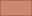

# dircolors Themes

Reusable `dircolors` profiles and palette helpers for ANSI-slot-based terminals.

This repository currently includes:

- [`pastel.dircolors`](./pastel.dircolors): custom Pastel `dircolors` profile
- [`pastel_palette.sh`](./pastel_palette.sh): shell exports for the Pastel palette and default profile colors
- [`pastel_ls_colors_preview.sh`](./pastel_ls_colors_preview.sh): static `LS_COLORS` preview for the Pastel profile
- [`nord.dircolors`](./nord.dircolors): Nord-based `dircolors` profile

## Usage

Apply a profile directly with `dircolors`:

```bash
eval "$(dircolors -b ./pastel.dircolors)"
eval "$(dircolors -b ./nord.dircolors)"
```

Load the Pastel palette metadata into your current shell:

```bash
source ./pastel_palette.sh
echo "$PASTEL_PROFILE_FOREGROUND_HEX"
echo "$PASTEL_ANSI_12_HEX"
```

## ANSI Palette Note

`dircolors` only emits ANSI SGR codes such as `34`, `95`, or `44`. The final appearance therefore depends on how your terminal maps ANSI color slots `0` through `15`.

- The Pastel profile ships its intended slot values in [`pastel_palette.sh`](./pastel_palette.sh).
- The Nord profile assumes the standard `nord0` through `nord15` mapping used by the upstream [Nord project](https://www.nordtheme.com/) and its [color palette documentation](https://www.nordtheme.com/docs/colors-and-palettes/).

## Pastel

Pastel is a soft custom palette with a very dark background, a bright off-white foreground, and low-harshness accent colors for the 16 ANSI terminal slots.

### Profile Colors

| Sample                                          | Role       | #    | ANSI               | Hex       | RGB           |
|-------------------------------------------------|------------|------|--------------------|-----------|---------------|
|  | Foreground | `fg` | default foreground | `#eff0f3` | `239 240 243` |
|  | Background | `bg` | default background | `#191a1c` | `25 26 28`    |

### ANSI Palette

| Sample                                    | Role           | #    | ANSI       | Hex       | RGB           |
|-------------------------------------------|----------------|------|------------|-----------|---------------|
|    | Black          | `0`  | `30 / 40`  | `#1e1f22` | `30 31 34`    |
|    | Red            | `1`  | `31 / 41`  | `#f89494` | `248 148 148` |
|    | Green          | `2`  | `32 / 42`  | `#b2e4a7` | `178 228 167` |
|    | Yellow         | `3`  | `33 / 43`  | `#ffef9f` | `255 239 159` |
|    | Blue           | `4`  | `34 / 44`  | `#a9c7f1` | `169 199 241` |
|    | Magenta        | `5`  | `35 / 45`  | `#cfbaf0` | `207 186 240` |
|    | Cyan           | `6`  | `36 / 46`  | `#96c2c6` | `150 194 198` |
|    | White          | `7`  | `37 / 47`  | `#f1edfb` | `241 237 251` |
|    | Bright black   | `8`  | `90 / 100` | `#393b40` | `57 59 64`    |
|    | Bright red     | `9`  | `91 / 101` | `#fda5ac` | `253 165 172` |
|  | Bright green   | `10` | `92 / 102` | `#b9fbc0` | `185 251 192` |
|  | Bright yellow  | `11` | `93 / 103` | `#fdffb6` | `253 255 182` |
|  | Bright blue    | `12` | `94 / 104` | `#b1e5f7` | `177 229 247` |
|  | Bright magenta | `13` | `95 / 105` | `#f1c7e9` | `241 199 233` |
|  | Bright cyan    | `14` | `96 / 106` | `#c0fdff` | `192 253 255` |
|  | Bright white   | `15` | `97 / 107` | `#fcfcfc` | `252 252 252` |

## Nord

Nord is an arctic, north-bluish palette created by the [Nord project](https://www.nordtheme.com/) and documented in the official [colors and palettes reference](https://www.nordtheme.com/docs/colors-and-palettes/). The `nord.dircolors` file in this repository follows the canonical `nord0` through `nord15` slot numbering used for terminal color compatibility.

| Sample                      | Token    | #    | ANSI       | Hex       | Palette     |
|-----------------------------|----------|------|------------|-----------|-------------|
|    | `nord0`  | `0`  | `30 / 40`  | `#2e3440` | Polar Night |
|    | `nord1`  | `1`  | `31 / 41`  | `#3b4252` | Polar Night |
|    | `nord2`  | `2`  | `32 / 42`  | `#434c5e` | Polar Night |
|    | `nord3`  | `3`  | `33 / 43`  | `#4c566a` | Polar Night |
|    | `nord4`  | `4`  | `34 / 44`  | `#d8dee9` | Snow Storm  |
|    | `nord5`  | `5`  | `35 / 45`  | `#e5e9f0` | Snow Storm  |
|    | `nord6`  | `6`  | `36 / 46`  | `#eceff4` | Snow Storm  |
|    | `nord7`  | `7`  | `37 / 47`  | `#8fbcbb` | Frost       |
|    | `nord8`  | `8`  | `90 / 100` | `#88c0d0` | Frost       |
|    | `nord9`  | `9`  | `91 / 101` | `#81a1c1` | Frost       |
|  | `nord10` | `10` | `92 / 102` | `#5e81ac` | Frost       |
|  | `nord11` | `11` | `93 / 103` | `#bf616a` | Aurora      |
|  | `nord12` | `12` | `94 / 104` | `#d08770` | Aurora      |
|  | `nord13` | `13` | `95 / 105` | `#ebcb8b` | Aurora      |
|  | `nord14` | `14` | `96 / 106` | `#a3be8c` | Aurora      |
|  | `nord15` | `15` | `97 / 107` | `#b48ead` | Aurora      |

## Sources

- Pastel values are defined locally in [`pastel_palette.sh`](./pastel_palette.sh).
- Nord palette values come from the official [Nord project](https://www.nordtheme.com/) and its [Colors and Palettes documentation](https://www.nordtheme.com/docs/colors-and-palettes/).
